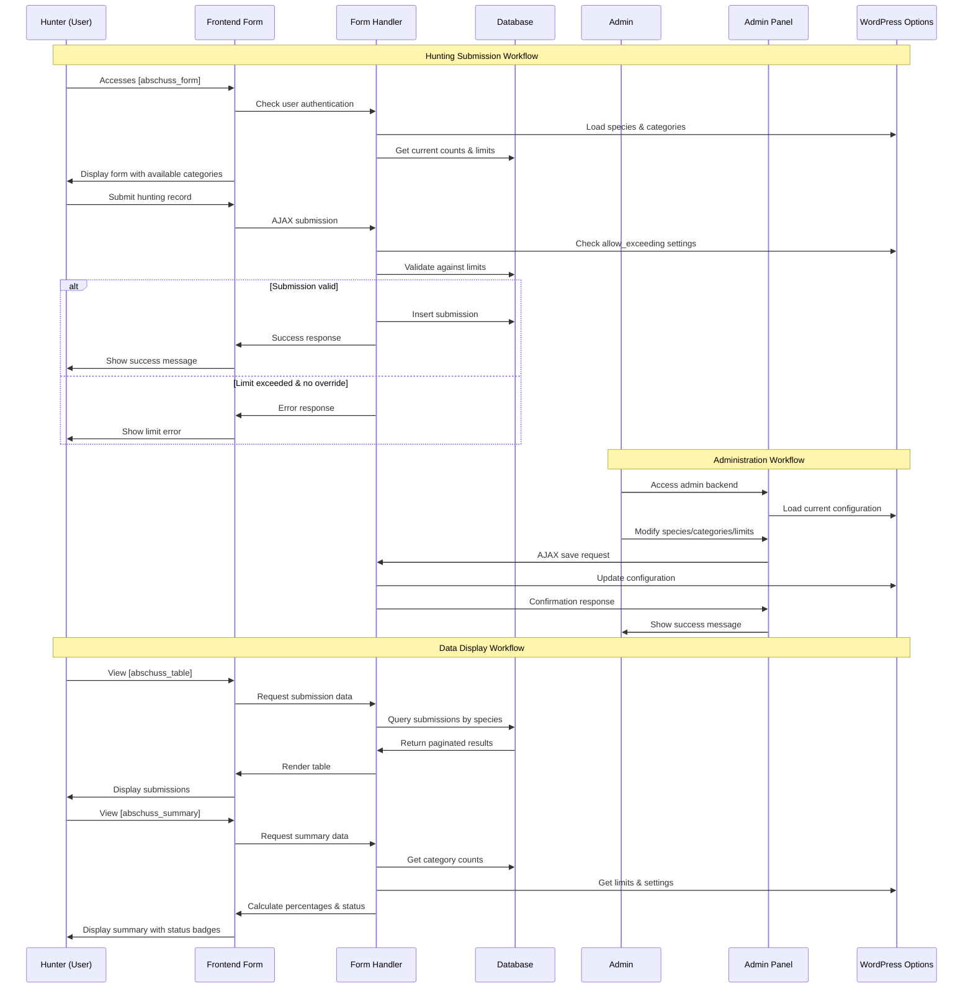
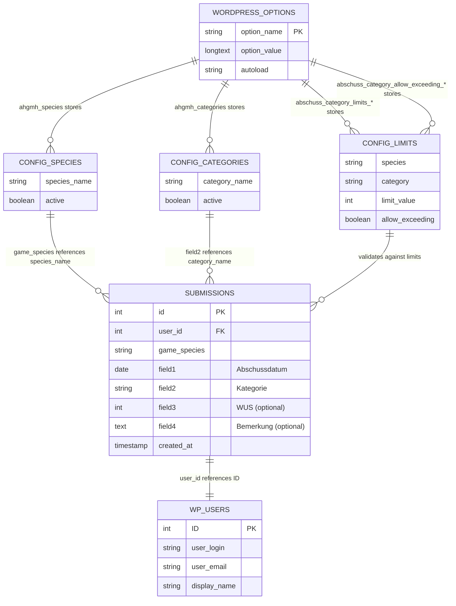

# Anforderungsdokumentation: Abschussplan HGMH WordPress Plugin

## 1. Überblick

Das **Abschussplan HGMH** Plugin ist eine spezialisierte WordPress-Erweiterung für die Verwaltung von Jagdabschussmeldungen in deutschen Jagdrevieren. Das Plugin ermöglicht es Jägern, ihre Abschüsse digital zu melden und Administratoren, diese zu verwalten und auszuwerten.

### 1.1 Zweck
- Digitale Erfassung von Jagdabschüssen
- Verwaltung von Abschusslimits (Soll-Werte)
- Überwachung und Auswertung der Abschussstatistiken
- Compliance mit behördlichen Meldepflichten

### 1.2 Zielgruppe
- **Jäger**: Melden ihre Abschüsse über Webformulare
- **Revierleiter/Administratoren**: Verwalten Limits, Wildarten und werten Statistiken aus
- **Behörden**: Erhalten strukturierte Abschussberichte

## 2. Benutzerrollen und Berechtigungen

### 2.1 Angemeldete Benutzer
- **Berechtigung**: Abschussmeldungen erstellen
- **Zugriff**: Frontend-Formulare via Shortcodes
- **Einschränkungen**: Nur eigene Meldungen, keine Administrationsrechte

### 2.2 Administratoren
- **Berechtigung**: Vollzugriff auf alle Funktionen
- **Zugriff**: Backend-Administration, Konfiguration, Berichte
- **Capabilities**: WordPress `manage_options` Berechtigung erforderlich

### 2.3 Nicht angemeldete Benutzer
- **Berechtigung**: Keine
- **Verhalten**: Weiterleitung zur Anmeldung bei Zugriff auf Formulare

## 3. Kernanforderungen

### 3.1 Wildartenverwaltung
- **Dynamische Wildarten**: Konfigurierbare Liste von Wildarten (Standard: Rotwild, Damwild)
- **Verwaltung**: Hinzufügen, Bearbeiten, Löschen von Wildarten
- **Persistenz**: Wildarten bleiben über alle Systemteile synchron

### 3.2 Kategorienverwaltung
- **Dynamische Kategorien**: Konfigurierbare Abschusskategorien
- **Wildartspezifisch**: Jede Wildart kann eigene Kategorien haben
- **Flexibilität**: Administratoren können Kategorien anpassen

### 3.3 Limitverwaltung (Soll-Werte)
- **Wildartspezifische Limits**: Separate Limits pro Wildart und Kategorie
- **Überschreitungsregelung**: Konfigurierbare "Überschießen möglich?" Option pro Kategorie
- **Dynamische Anpassung**: Limits können jederzeit geändert werden

## 4. Frontend-Funktionalität (Shortcodes)

> **Hinweis:** Die folgenden Screenshots zeigen die tatsächliche Darstellung der Shortcodes im Frontend.

### 4.1 Abschussformular `[abschuss_form]`
```
[abschuss_form species="Rotwild"]
```

**Parameter:**
- `species`: Wildart (Pflicht)

**Funktionalität:**
- Authentifizierung erforderlich
- Felder:
  - **Abschussdatum**: Datumswähler (nicht in der Zukunft)
  - **Abschuss**: Dropdown mit verfügbaren Kategorien
  - **WUS**: Numerisches Feld (optional)
  - **Bemerkung**: Textfeld (optional)
- **Validierung**:
  - Limitprüfung mit Überschreitungslogik
  - Datumsvalidierung
  - AJAX-basierte Echtzeitvalidierung
- **Verhalten**: Kategorien werden automatisch deaktiviert wenn Limit erreicht und Überschreitung nicht erlaubt

#### Screenshot: Abschussformular

*Das Abschussformular zeigt die Benutzerauthentifizierung, Eingabefelder für Datum, Kategorie-Dropdown, WUS und Bemerkung. Kategorien sind entsprechend ihrer Limit-Status aktiviert/deaktiviert.*

### 4.2 Abschusstabelle `[abschuss_table]`
```
[abschuss_table species="Rotwild" limit="10" page="1"]
```

**Parameter:**
- `species`: Wildart (optional, zeigt alle wenn leer)
- `limit`: Anzahl Einträge pro Seite (Standard: 10)
- `page`: Seitennummer (Standard: 1)

**Funktionalität:**
- Paginierte Anzeige aller Abschussmeldungen
- Filterung nach Wildart
- Sortierung nach Datum (neueste zuerst)
- Responsive Tabellendarstellung

#### Screenshot: Abschusstabelle

*Die Abschusstabelle zeigt eine paginierte Liste aller Meldungen mit Spalten für Datum, Kategorie, WUS, Bemerkung und Benutzer. Navigation zwischen Seiten und responsive Layout.*

### 4.3 Zusammenfassung `[abschuss_summary]`
```
[abschuss_summary species="Rotwild"]
```

**Parameter:**
- `species`: Wildart (Pflicht)

**Funktionalität:**
- Übersichtstabelle: Kategorie, Ist-Werte, Soll-Werte, Status
- Prozentuale Auslastung der Limits
- Farbkodierte Statusanzeige:
  - Grün: < 90% des Limits
  - Gelb: 90-99% des Limits
  - Rot: ≥ 100% des Limits

#### Screenshot: Zusammenfassung

*Die Zusammenfassungsansicht zeigt eine Übersichtstabelle mit aktuellen Zählerständen, konfigurierten Limits und farbkodierten Statusbadges (grün/gelb/rot) für jede Kategorie.*

### 4.4 Limitkonfiguration `[abschuss_limits]`
```
[abschuss_limits species="Rotwild"]
```

**Parameter:**
- `species`: Wildart (Pflicht)

**Funktionalität:**
- **Administrationstool** (nur für Benutzer mit `manage_options`)
- Konfiguration von Soll-Werten pro Kategorie
- "Überschießen möglich?" Checkbox pro Kategorie
- AJAX-basiertes Speichern
- Echtzeit-Statusanzeige der aktuellen Auslastung

#### Screenshot: Limitkonfiguration

*Die Limitkonfiguration zeigt eine Administrationstabelle mit Eingabefeldern für Soll-Werte, Checkboxen für "Überschießen möglich?" und Live-Statusanzeige der aktuellen Auslastung.*

## 5. Backend-Administration

> **Hinweis:** Die folgenden Screenshots zeigen die Backend-Administrationsseiten für Benutzer mit `manage_options` Berechtigung.

### 5.1 Hauptnavigation
Das Plugin fügt ein Hauptmenü "Abschussplan" mit folgenden Unterseiten hinzu:

### 5.2 Übersicht
- **Wildartauswahl**: Dropdown zur Auswahl der anzuzeigenden Wildart
- **Zusammenfassungsstatistiken**: Gesamtanzahl Meldungen, aktuelle Zählstände
- **Kategorienübersicht**: Tabelle aller Kategorien mit:
  - Aktueller Zählerstand (Ist)
  - Konfiguriertes Limit (Soll)
  - Überschreitungsstatus
  - Prozentuale Auslastung
  - Farbkodierte Statusbadges

#### Screenshot: Backend Übersicht

*Die Backend-Übersicht zeigt die Wildartauswahl, Zusammenfassungsstatistiken und eine detaillierte Kategorienübersicht mit Ist/Soll-Werten und Statusbadges.*

### 5.3 Abschussplanung
- **Wildartspezifische Konfiguration**: Dropdown zur Wildartauswahl
- **Limitverwaltung**: 
  - Numerische Eingabe für Soll-Werte pro Kategorie
  - Checkbox "Überschießen möglich?" pro Kategorie
  - Live-Vorschau der aktuellen Auslastung
- **Speicherfunktion**: AJAX-basiert mit Erfolgsmeldungen
- **Validierung**: Numerische Limits, Sicherheitschecks

#### Screenshot: Abschussplanung

*Die Abschussplanung zeigt die wildartspezifische Konfiguration mit Dropdown-Auswahl, Eingabefeldern für Limits, Checkboxen für Überschreitungen und Live-Vorschau der Auslastung.*

### 5.4 Wildarten
- **CRUD-Operationen**: Erstellen, Lesen, Bearbeiten, Löschen von Wildarten
- **Dynamische Liste**: Eingabefelder mit Hinzufügen/Entfernen-Buttons
- **Persistierung**: Änderungen werden sofort in allen anderen Bereichen übernommen

#### Screenshot: Wildarten-Verwaltung

*Die Wildarten-Verwaltung zeigt dynamische Eingabefelder mit Hinzufügen/Entfernen-Buttons und Speicherfunktion für die Konfiguration verfügbarer Wildarten.*

### 5.5 Kategorien
- **CRUD-Operationen**: Erstellen, Lesen, Bearbeiten, Löschen von Kategorien
- **Dynamische Liste**: Eingabefelder mit Hinzufügen/Entfernen-Buttons
- **Globale Verfügbarkeit**: Kategorien stehen für alle Wildarten zur Verfügung

#### Screenshot: Kategorien-Verwaltung

*Die Kategorien-Verwaltung zeigt die CRUD-Operationen mit dynamischen Eingabefeldern und globaler Verfügbarkeit für alle Wildarten.*

### 5.6 Datenbankeinstellungen
- **Multi-Datenbank-Unterstützung**:
  - SQLite (Standard)
  - MySQL
  - PostgreSQL
- **Konfigurationsoptionen**:
  - Datenbanktyp-Auswahl
  - Verbindungsparameter (Host, Port, Benutzername, Passwort)
  - Dateiname für SQLite
- **Verbindungstest**: Test-Button zur Validierung der Datenbankverbindung

#### Screenshot: Datenbankeinstellungen

*Die Datenbankeinstellungen zeigen die Multi-Datenbank-Unterstützung mit Auswahloptionen für SQLite/MySQL/PostgreSQL, Konfigurationsfeldern und Verbindungstest-Funktionalität.*

## 6. Datenmodell

### 6.1 Abschussmeldungen
```sql
- ID: Eindeutige Kennung
- user_id: WordPress Benutzer-ID
- game_species: Wildart
- field1: Abschussdatum (DATUM)
- field2: Kategorie (TEXT)
- field3: WUS (INTEGER, optional)
- field4: Bemerkung (TEXT, optional)
- created_at: Erstellungszeitpunkt
```

### 6.2 WordPress Options
- `ahgmh_species`: Array der verfügbaren Wildarten
- `ahgmh_categories`: Array der verfügbaren Kategorien
- `abschuss_category_limits_{species}`: Limits pro Wildart
- `abschuss_category_allow_exceeding_{species}`: Überschreitungseinstellungen pro Wildart
- `abschuss_db_config`: Datenbankkonfiguration

## 7. Technische Anforderungen

### 7.1 WordPress-Anforderungen
- **WordPress Version**: 5.0 oder höher
- **PHP Version**: 7.4 oder höher
- **MySQL Version**: 5.6 oder höher (falls MySQL verwendet)

### 7.2 Abhängigkeiten
- **jQuery**: Für Frontend-Interaktivität
- **jQuery UI**: Für Datepicker-Funktionalität
- **Bootstrap CSS**: Für responsive Layouts (optional)

### 7.3 Datenbankunterstützung
- **SQLite**: Standard, keine zusätzliche Konfiguration erforderlich
- **MySQL**: WordPress-Standard-Datenbank
- **PostgreSQL**: Erweiterte Option für große Installationen

## 8. Sicherheitsanforderungen

### 8.1 Authentifizierung
- WordPress-native Authentifizierung erforderlich
- Capability-basierte Zugriffskontrollen (`manage_options` für Administration)

### 8.2 Datenvalidierung
- **Nonce-Verifikation**: Alle AJAX-Calls und Formulare
- **Sanitization**: Alle Benutzereingaben werden bereinigt
- **Validation**: Datentyp- und Wertebereichsprüfungen

### 8.3 SQL-Injection-Schutz
- Prepared Statements für alle Datenbankoperationen
- WordPress Database Abstraction Layer

### 8.4 Cross-Site-Scripting (XSS) Schutz
- `esc_html()`, `esc_attr()` für alle Ausgaben
- Validierung von HTML-Inhalten

## 9. Benutzerfreundlichkeit

### 9.1 Responsive Design
- Mobile-optimierte Formulare und Tabellen
- Touch-freundliche Bedienelemente
- Adaptive Layouts für verschiedene Bildschirmgrößen

### 9.2 Internationalisierung
- Deutsche Übersetzungen für alle Texte
- Verwendung von WordPress `__()` Funktionen
- Textdomain: `abschussplan-hgmh`

### 9.3 Barrierefreiheit
- Semantic HTML-Struktur
- Tastaturnavigation möglich
- Screen-Reader-kompatible Labels

## 10. Performance-Anforderungen

### 10.1 Ladezeiten
- AJAX-basierte Interaktionen für schnelle Responsivität
- Paginierung für große Datenmengen
- Optimierte Datenbankabfragen

### 10.2 Skalierbarkeit
- Unterstützung für mehrere tausend Abschussmeldungen
- Effiziente Indexierung der Datenbank
- Caching-freundliche Implementierung

## 11. Wartung und Support

### 11.1 Logging
- Detaillierte Fehlerprotokollierung
- Debug-Modi für Entwicklung
- Console-Logging für AJAX-Operationen

### 11.2 Backup-Kompatibilität
- Unterstützung für WordPress-Backup-Plugins
- Exportierbare Konfiguration
- Datenbank-agnostische Datenstruktur

### 11.3 Update-Sicherheit
- Rückwärtskompatible Datenstrukturen
- Migrationsroutinen für Datenbankänderungen
- Konfigurationssicherung bei Updates

## 12. Compliance und Rechtskonformität

### 12.1 Datenschutz (DSGVO)
- Minimale Datenerfassung
- Benutzer-ID-Verknüpfung zu WordPress-Konten
- Löschbarkeit von Benutzerdaten

### 12.2 Jagdrechtliche Anforderungen
- Vollständige Erfassung aller relevanten Abschussdaten
- Nachvollziehbare Dokumentation
- Exportierbare Berichte für Behörden

### 12.3 Audit-Trail
- Zeitstempel für alle Änderungen
- Benutzer-ID-Verknüpfung für Nachverfolgbarkeit
- Unveränderlichkeit gespeicherter Meldungen

## 13. Systemarchitektur-Diagramme

Die folgenden Diagramme veranschaulichen die technische Architektur und Datenflüsse des Abschussplan HGMH Plugins.

### 13.1 Plugin-Architektur-Übersicht

Dieses Diagramm zeigt die Gesamtarchitektur des Plugins mit allen Hauptkomponenten, Benutzerrollen und deren Interaktionen.

```mermaid
graph TB
    %% Main Plugin Structure
    subgraph "WordPress Plugin: Abschussplan HGMH"
        MainPlugin[abschussplan-hgmh.php<br/>Main Plugin File]
        
        subgraph "Core Classes"
            FormHandler[AHGMH_Form_Handler<br/>Form Operations & Shortcodes]
            AdminPage[AHGMH_Admin_Page<br/>Backend Administration]
            Database[AHGMH_Database<br/>Data Persistence]
        end
        
        subgraph "Frontend Shortcodes"
            FormShortcode["[abschuss_form]<br/>Submission Form"]
            TableShortcode["[abschuss_table]<br/>Data Display"]
            SummaryShortcode["[abschuss_summary]<br/>Statistics Overview"]
            LimitsShortcode["[abschuss_limits]<br/>Limits Configuration"]
        end
        
        subgraph "Admin Backend"
            OverviewPage[Übersicht<br/>Species-specific Overview]
            PlanningPage[Abschussplanung<br/>Limits Management]
            SpeciesPage[Wildarten<br/>Species Management]
            CategoriesPage[Kategorien<br/>Categories Management]
            DatabasePage[Datenbankeinstellungen<br/>DB Configuration]
        end
        
        subgraph "Data Storage"
            WPOptions[WordPress Options<br/>Configuration Data]
            SubmissionDB[Database Tables<br/>Submission Records]
        end
    end
    
    %% User Interactions
    subgraph "User Roles"
        Hunters[Hunters<br/>Logged-in Users]
        Admins[Administrators<br/>manage_options]
        Anonymous[Anonymous Users]
    end
    
    %% External Systems
    subgraph "External Dependencies"
        WordPress[WordPress Core<br/>Authentication & Capabilities]
        jQuery[jQuery/jQuery UI<br/>Frontend Interactions]
        DBSystems[Database Systems<br/>SQLite/MySQL/PostgreSQL]
    end
    
    %% Connections - Main Plugin Structure
    MainPlugin --> FormHandler
    MainPlugin --> AdminPage
    MainPlugin --> Database
    
    %% Frontend Shortcode Connections
    FormHandler --> FormShortcode
    FormHandler --> TableShortcode
    FormHandler --> SummaryShortcode
    FormHandler --> LimitsShortcode
    
    %% Backend Admin Connections
    AdminPage --> OverviewPage
    AdminPage --> PlanningPage
    AdminPage --> SpeciesPage
    AdminPage --> CategoriesPage
    AdminPage --> DatabasePage
    
    %% Data Flow Connections
    FormHandler --> WPOptions
    FormHandler --> SubmissionDB
    AdminPage --> WPOptions
    Database --> SubmissionDB
    Database --> DBSystems
    
    %% User Access Patterns
    Hunters --> FormShortcode
    Hunters --> TableShortcode
    Hunters --> SummaryShortcode
    Anonymous -.-> FormShortcode
    Anonymous -.-> |Redirect to Login| WordPress
    
    Admins --> LimitsShortcode
    Admins --> OverviewPage
    Admins --> PlanningPage
    Admins --> SpeciesPage
    Admins --> CategoriesPage
    Admins --> DatabasePage
    
    %% External Dependencies
    FormHandler --> WordPress
    AdminPage --> WordPress
    FormShortcode --> jQuery
    LimitsShortcode --> jQuery
    
    %% AJAX Connections
    FormShortcode -.-> |AJAX| FormHandler
    LimitsShortcode -.-> |AJAX| FormHandler
    PlanningPage -.-> |AJAX| AdminPage
    
    %% Data Relationships
    WPOptions --> |Species Config| SpeciesPage
    WPOptions --> |Categories Config| CategoriesPage
    WPOptions --> |Limits Config| PlanningPage
    WPOptions --> |Allow Exceeding Config| LimitsShortcode
    
    %% Styling
    classDef userClass fill:#e1f5fe
    classDef adminClass fill:#fff3e0
    classDef shortcodeClass fill:#f3e5f5
    classDef storageClass fill:#e8f5e8
    classDef externalClass fill:#fce4ec
    
    class Hunters,Anonymous userClass
    class Admins adminClass
    class FormShortcode,TableShortcode,SummaryShortcode,LimitsShortcode shortcodeClass
    class WPOptions,SubmissionDB storageClass
    class WordPress,jQuery,DBSystems externalClass
```



**Beschreibung:** Die Architektur zeigt die drei Kernklassen (Form Handler, Admin Page, Database), vier Frontend-Shortcodes, fünf Admin-Backend-Seiten und deren Verbindungen. Farbkodierte Bereiche unterscheiden zwischen Benutzerrollen (blau), Admin-Funktionen (orange), Shortcodes (lila), Datenspeicherung (grün) und externen Abhängigkeiten (pink).

### 13.2 Prozessfluss-Diagramm

Dieses Sequenzdiagramm illustriert die wichtigsten Arbeitsabläufe und Datenflüsse zwischen Benutzern, Frontend, Backend und Datenbank.



**Beschreibung:** Das Sequenzdiagramm zeigt drei Hauptprozesse: 1) **Abschussmeldung-Workflow** - von der Formularanzeige bis zur Validierung und Speicherung, 2) **Administrations-Workflow** - Konfigurationsänderungen durch Administratoren, und 3) **Datenanzeige-Workflow** - wie Tabellen und Zusammenfassungen generiert werden. Besondere Aufmerksamkeit liegt auf der Limitvalidierung mit Überschreitungslogik.

### 13.3 Datenmodell und Beziehungen

Dieses Entity-Relationship-Diagramm zeigt die Datenbankstruktur und die Beziehungen zwischen den verschiedenen Datenentitäten.



**Beschreibung:** Das Datenmodell zeigt die zentrale **SUBMISSIONS**-Tabelle mit Verknüpfungen zur WordPress-Benutzertabelle. Konfigurationsdaten werden in der **WORDPRESS_OPTIONS**-Tabelle gespeichert, einschließlich Wildarten (`ahgmh_species`), Kategorien (`ahgmh_categories`), Limits (`abschuss_category_limits_*`) und Überschreitungseinstellungen (`abschuss_category_allow_exceeding_*`). Die Stern-Notation (*) steht für wildartspezifische Option-Keys.

### 13.4 Technische Hinweise zu den Diagrammen

- **Architektur-Diagramm**: Zeigt die Plugin-Struktur und Komponentenbeziehungen
- **Prozessfluss-Diagramm**: Illustriert typische Benutzerinteraktionen und Systemresponses  
- **Datenmodell-Diagramm**: Dokumentiert die Datenbankstruktur und Referential Integrity

Diese Diagramme dienen als technische Referenz für Entwickler, Systemadministratoren und zur Dokumentation der Plugin-Architektur.

## 14. Screenshots und Visuelle Dokumentation

### 14.1 Verzeichnisstruktur für Screenshots
```
screenshots/
├── abschuss-form.png          # [abschuss_form] Shortcode
├── abschuss-table.png         # [abschuss_table] Shortcode  
├── abschuss-summary.png       # [abschuss_summary] Shortcode
├── abschuss-limits.png        # [abschuss_limits] Shortcode
├── backend-overview.png       # Übersicht Administrationsseite
├── backend-planning.png       # Abschussplanung Administrationsseite
├── backend-species.png        # Wildarten Administrationsseite
├── backend-categories.png     # Kategorien Administrationsseite
└── backend-database.png       # Datenbankeinstellungen Administrationsseite
```

### 14.2 Anleitung für Screenshot-Erstellung

#### Frontend Screenshots (Shortcodes):
1. **[abschuss_form]**: Zeige das vollständige Formular mit allen Feldern, Validierung und Benutzerauthentifizierung
2. **[abschuss_table]**: Zeige paginierte Tabelle mit mehreren Einträgen und Navigationselementen
3. **[abschuss_summary]**: Zeige Übersichtstabelle mit verschiedenen Statusbadges (grün/gelb/rot)
4. **[abschuss_limits]**: Zeige Administratorformular mit Eingabefeldern und Checkboxen

#### Backend Screenshots:
1. **Übersicht**: Wildartauswahl-Dropdown und vollständige Kategorienübersicht
2. **Abschussplanung**: Limitkonfiguration mit Live-Vorschau der Auslastung
3. **Wildarten**: Dynamische Eingabefelder mit Hinzufügen/Entfernen-Buttons
4. **Kategorien**: CRUD-Interface für Kategorieverwaltung
5. **Datenbankeinstellungen**: Datenbanktyp-Auswahl und Konfigurationsoptionen

#### Technische Anforderungen für Screenshots:
- **Auflösung**: Mindestens 1200px Breite für Desktop-Ansicht
- **Format**: PNG für beste Qualität
- **Browser**: Aktueller Chrome/Firefox für konsistente Darstellung
- **Responsive**: Zusätzliche mobile Screenshots bei Bedarf
- **Datenschutz**: Keine echten Benutzerdaten in Screenshots verwenden

---

**Version:** 1.0  
**Erstellt:** 2025  
**Zielgruppe:** Entwickler, Systemadministratoren, Jagdrevierverwalter  
**Status:** Vollständig implementiert